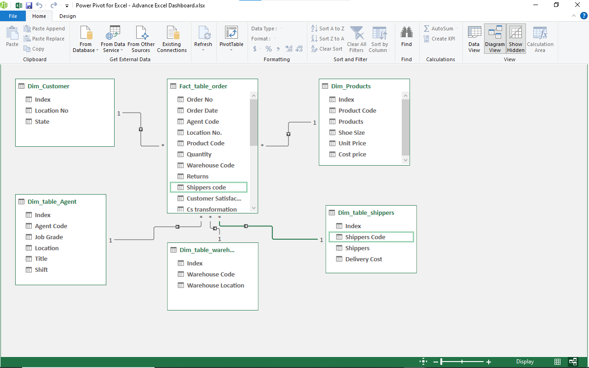
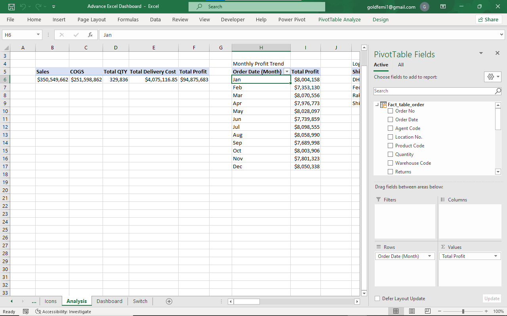

# Keynet online Fashion Retail store Performance Report  

## INTRODUCTION
Keynet is a fictitious online retail store that sells Fashion items to smaller retailers and end consumers. The sales dataset between 2019-2020 was provided, as management wants to gain insights into factors that affected Sales Performance. The company is also seeking guidance into products and locations that are performing and not performing well so they can keep clear focus on what is working  

## PROBLEM STATEMENT 
As a Data Analyst, I was tasked to analyze the dataset and design a dynamic report that tracks the KPIs like Quantity ordered, Cost of Goods sold (COGS), Revenue, Gross Profit and the cost of shipping. 
Also show which products are being ordered the most and which location is most profitable. They also want to see an overview of the customer ratings. The cost of shipping was required to be broken down

## SKILLS/CONCEPT DEMONSTRATED
Data cleaning, powerQuery Functions, Data Transformation, Data Modeling, Data analysis & visualization 

## DATA TRANSFORMATION AND CLEANING
The entire project was carried out using Excel. The Dataset was loaded to power-query and the following activities took place
- The tables were properly named to ensure easy identification.
- Data was checked for errors and was cleaned. There was also conditional formatting 
- After all checks have been concluded the data was save and loaded to only create a connection.
- The power-pivot was open to perform the data modelling and creating of measures. The power-pivot allows for the use of DAX so measures for KPIs were also created

**Data Modeling**\
The Data Modelling was done to connect related tables together. Since the tables have been grouped into fact tables and dimension table connecting them together wasn’t much of a hassle. 
The KPIs were created using DAX in the power pivot
Pivot table was used to derive insights which were later converted to desired charts.   

**Data visualization & Insights**\
This Excel report is a single paged interactive report which consists of navigation buttons to further interact with the report. This interactive report also includes the Calendar which acts as filter where you can filter to see analysis within a certain period

## INSIGHTS
- A total quantity of 329,836 were ordered and shipped during this period, equating to a revenue of $350.5M
- The total cost of goods sold was $251.6M and the cost of Shipping was discovered to be $4.01M when subtracted from the total revenue, the gross Profit was $94M  
- Top 4 most ordered product were Adidas shoe, Derby shoe, Diabetic shoe, Fashion shoe
- The Profit made in 2020 contributed 64% of the total profit made 2019-2020 
- The top most profitable location include California, Illinois, Mississipi and Misouri
- The warehouse with the highest quantity sold were Illinois, Georgia, New York and California 
- More Customers appeared to be satisfied with the products as 40% were highly satisfied, while 31% were averagely satisfied and 28% were less satisfied 
 
**Recommendations**
- A considerable percentage of customers were less satisfied with the products. This could range from a couple of reasons and should be looked into. 
- The Demographics of customers in the most profitable locations should be research into to understand their buying pattern 

